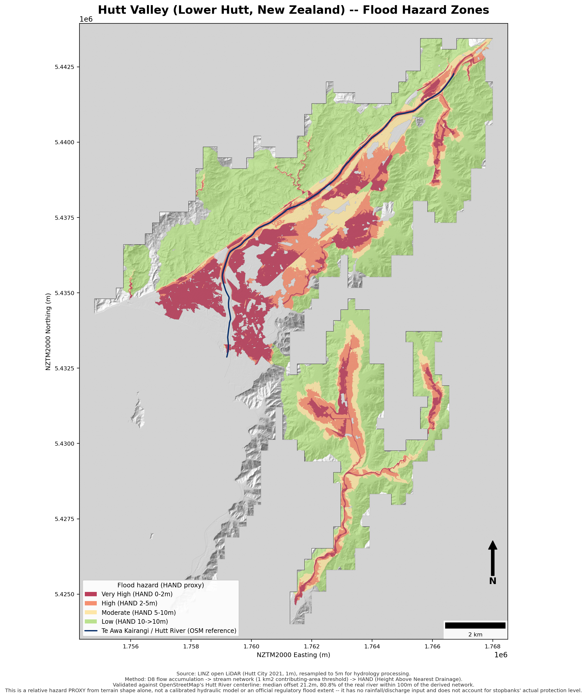

# Hutt Valley Flood Hazard Mapping

DEM-derived flood hazard indicator and cartographic map for the Hutt Valley (Lower Hutt,
Wellington Region, New Zealand) — New Zealand's most densely populated floodplain — built from
open LiDAR, using a HAND (Height Above Nearest Drainage) pipeline, and validated against the
real Hutt River / Te Awa Kairangi.



## Result

Median offset between the derived stream network and the real river: **21.2 m**. 80.8% of the
real river falls within 100 m of the derived network. Full methodology, validation, and stated
limitations: **[REPORT.md](REPORT.md)**.

## Pipeline

```
download_hutt_dem.py               -> data/dem_1m_raw/            (run locally)
download_hutt_river_centerline.py  -> data/hutt_river_osm.geojson (run locally)
step1_mosaic_dem.py                -> outputs/hutt_dem_1m_mosaic.tif
step2_hydrology.py                 -> outputs/{hutt_dem_5m,flow_accum_5m,stream_mask_5m,hand_5m}.tif
step3_validate_stream_network.py   -> validation stats (console)
step4_hazard_classification_and_map.py -> outputs/flood_hazard_zones_5m.tif, maps/*.png
```

## Data sources

- LiDAR DEM: [LINZ Data Service](https://data.linz.govt.nz/) open elevation data, Hutt City
  2021 survey (CC-BY-4.0).
- River centerline (validation reference only): [OpenStreetMap](https://www.openstreetmap.org/)
  via the Overpass API.

## Stack

Python, `rasterio`, `pysheds` (D8 flow routing + HAND), `scipy` (validation), `matplotlib`
(cartography).

## Important note

This is a terrain-derived relative hazard **proxy**, not a calibrated hydraulic flood model —
it has no rainfall or discharge input and does not represent stopbanks' actual protection
level. See the Limitations section of [REPORT.md](REPORT.md) before using this for anything
beyond a portfolio/demonstration purpose.
