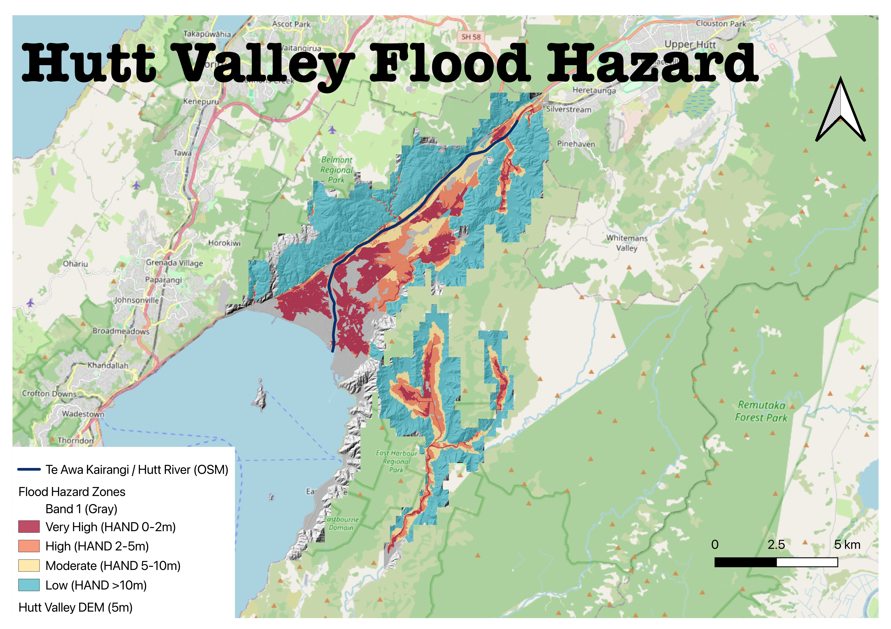

# Hutt Valley Flood Hazard Mapping

DEM-derived flood hazard indicator and cartographic map for the Hutt Valley (Lower Hutt,
Wellington Region, New Zealand) — New Zealand's most densely populated floodplain — built from
open LiDAR, using a HAND (Height Above Nearest Drainage) pipeline, and validated against the
real Hutt River / Te Awa Kairangi.



Cartography built in QGIS Desktop (real hillshade + paletted raster renderers, print layout,
legend, scale bar, north arrow) over an OpenStreetMap basemap — see
[scripts/step5_qgis_cartography.py](scripts/step5_qgis_cartography.py) for the PyQGIS build
script and `hutt_valley_flood_hazard.qgz` for the editable project. A second version built with
Python/matplotlib (no QGIS dependency, used during automated pipeline development) is at
[maps/hutt_valley_flood_hazard_map.png](maps/hutt_valley_flood_hazard_map.png).

## Result

Median offset between the derived stream network and the real river: **21.2 m**. 80.8% of the
real river falls within 100 m of the derived network. Full methodology, validation, and stated
limitations: **[REPORT.md](REPORT.md)**.

## Pipeline

```
download_hutt_dem.py               -> data/dem_1m_raw/            (run locally)
download_hutt_river_centerline.py  -> data/hutt_river_osm.geojson (run locally)
step1_mosaic_dem.py                -> outputs/hutt_dem_1m_mosaic.tif
step2_hydrology.py                 -> outputs/{hutt_dem_5m,flow_accum_5m,stream_mask_5m,hand_5m}.tif
step3_validate_stream_network.py   -> validation stats (console)
step4_hazard_classification_and_map.py -> outputs/flood_hazard_zones_5m.tif, maps/*.png
step5_qgis_cartography.py          -> maps/*_qgis.png/.pdf, hutt_valley_flood_hazard.qgz (run in QGIS)
fetch_live_conditions.py           -> data/live_conditions/ (live gauge monitor, see below)
```

## Live conditions monitor (agentic extension)

`scripts/fetch_live_conditions.py` extends the static hazard map into a lightweight monitoring
loop. It pulls live readings from two real, public, no-auth Hutt River gauges on GWRC's
[Hilltop Server](https://hilltop.gw.govt.nz/Data.hts/?Service=Hilltop&Request=SiteList) hydrology
service:

- **Hutt River at Birchville** — true volumetric flow (m3/sec), mid-valley.
- **Hutt River at Kaitoke** — water level (mm), upper catchment. This is stage, not flow —
  labelled honestly as such rather than implied to be the same kind of measurement.

Each run fetches a configurable lookback window (default 30 days), computes a 95th-percentile
watch threshold **from that gauge's own recent data** (not an arbitrary hardcoded number),
compares the latest reading against it, and appends a row to
`data/live_conditions/live_conditions_log.csv` plus a `latest_status.json` snapshot.

Run it:
```
python3 scripts/fetch_live_conditions.py
```

**This is a human-in-the-loop design, deliberately.** The script only flags "this reading is
unusually high compared to recent history" — it does not decide on its own what that means or
issue public alerts. When a run flags WATCH, share `latest_status.json` and I'll reason over it
against the validated hazard-zone map and write an honest, current assessment.

To run this on a real schedule rather than by hand, add it to your Mac's own scheduler
(`launchd`, since macOS deprecates plain cron for background jobs):

```bash
# ~/Library/LaunchAgents/com.huttvalley.livewatch.plist
cat > ~/Library/LaunchAgents/com.huttvalley.livewatch.plist << 'EOF'
<?xml version="1.0" encoding="UTF-8"?>
<!DOCTYPE plist PUBLIC "-//Apple//DTD PLIST 1.0//EN" "http://www.apple.com/DTDs/PropertyList-1.0.dtd">
<plist version="1.0">
<dict>
  <key>Label</key><string>com.huttvalley.livewatch</string>
  <key>ProgramArguments</key>
  <array>
    <string>/usr/bin/python3</string>
    <string>/Users/manu/Desktop/HuttValleyFloodHazard/scripts/fetch_live_conditions.py</string>
  </array>
  <key>StartInterval</key><integer>10800</integer> <!-- every 3 hours -->
  <key>StandardOutPath</key><string>/Users/manu/Desktop/HuttValleyFloodHazard/data/live_conditions/run.log</string>
  <key>StandardErrorPath</key><string>/Users/manu/Desktop/HuttValleyFloodHazard/data/live_conditions/run.err.log</string>
</dict>
</plist>
EOF
launchctl load ~/Library/LaunchAgents/com.huttvalley.livewatch.plist
```

To stop it: `launchctl unload ~/Library/LaunchAgents/com.huttvalley.livewatch.plist`. A simpler
(if less power-efficient) alternative is a plain crontab entry: `0 */3 * * * /usr/bin/python3
/Users/manu/Desktop/HuttValleyFloodHazard/scripts/fetch_live_conditions.py`.

## Data sources

- LiDAR DEM: [LINZ Data Service](https://data.linz.govt.nz/) open elevation data, Hutt City
  2021 survey (CC-BY-4.0).
- River centerline (validation reference only): [OpenStreetMap](https://www.openstreetmap.org/)
  via the Overpass API.

## Stack

Python, `rasterio`, `pysheds` (D8 flow routing + HAND), `scipy` (validation), `matplotlib`
(cartography).

## Important note

This is a terrain-derived relative hazard **proxy**, not a calibrated hydraulic flood model —
it has no rainfall or discharge input and does not represent stopbanks' actual protection
level. See the Limitations section of [REPORT.md](REPORT.md) before using this for anything
beyond a portfolio/demonstration purpose.
